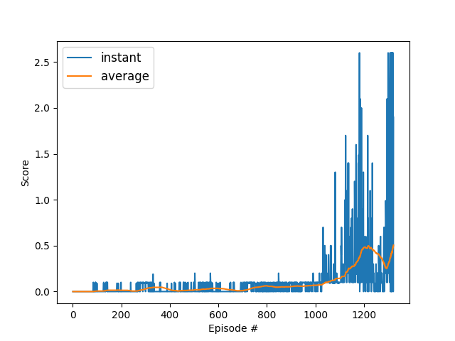

# Learning algorithm 

The task of learning a policy within the Unity ML-Agents [Tennis](https://github.com/Unity-Technologies/ml-agents/blob/master/docs/Learning-Environment-Examples.md#tennis) Environment was solved by means of [deep deterministic policy gradient (DDPG)](https://arxiv.org/abs/1509.02971) for agent training.

The DDPG was adapted for this competitive task with two agents, using a shared actor and critic network and shared experience replay buffer of size $10^{6}$. 
Mini-batches of size $64$ for utilized to train the network from the replay buffer (without prioritization).
An Ornstein-Uhlenbeck process noise ($\theta=0.8$, $\sigma=0.1$) was added to the learning to avoid getting stuck in local minima early.

The actor and critic network were chosen to have two hidden layers with $64$ nodes each, with relu activation for the hidden layers and tanh for the output layer.
A squared error loss function was chosen and the gradients obtained during backpropagation were clamped to a range of $[-1,1]$, both for actor and critic. 

The learning rate was set to $\alpha = 10^{-3}$ for actor and $\alpha = 10^{-4}$ for the critic.
Soft updates from local to target networks were carried out with $\tau = 10^{-2}$.

# Results

As can be seen from the plot, the the agent is able to receive an average reward over 0.5.
The target was reached after **1321 epsiodes**.

One particular challenge of this environment was to find a good balance between exploration and exploitation.
When using too few noise during learning, the average score would not evolve during learning process. On the other hand, utilizing too strong noise would make the learning not converge. 
Hence, the tuning of the Ornstein-Uhlenbeck process noise was quite sensitive.

# Outlook

Possible future work could compare the performance of DDPG with other distributed learning approaches. 
Another improvement could be adding prioritization to the replay buffer.
Also, further optimizing the variance and eigen-dynamics of the additive noise would be worth to evaluate to potentially reduce the number of required episodes.